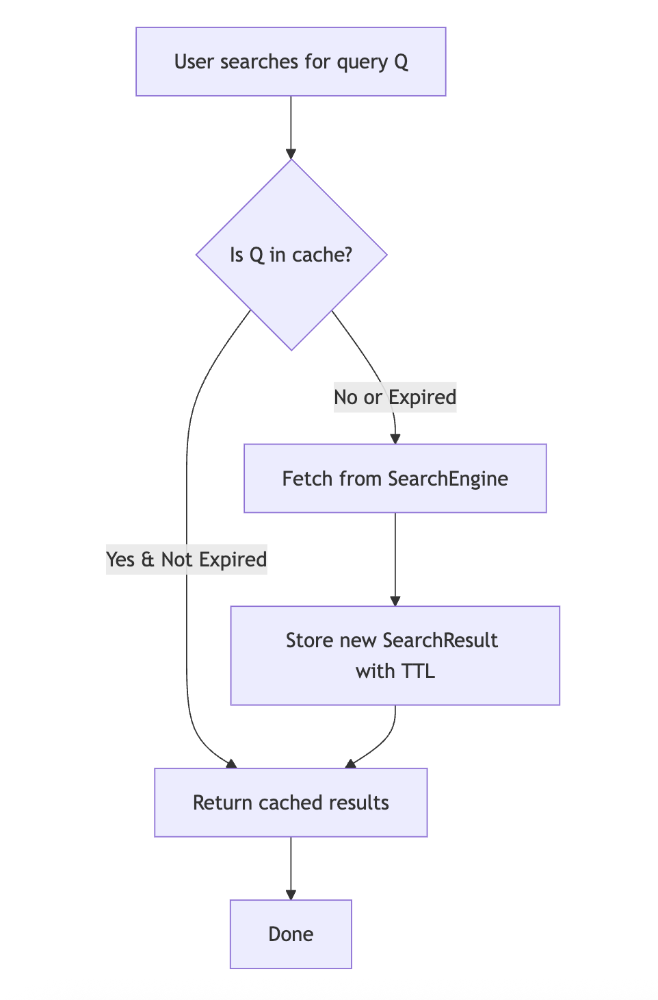
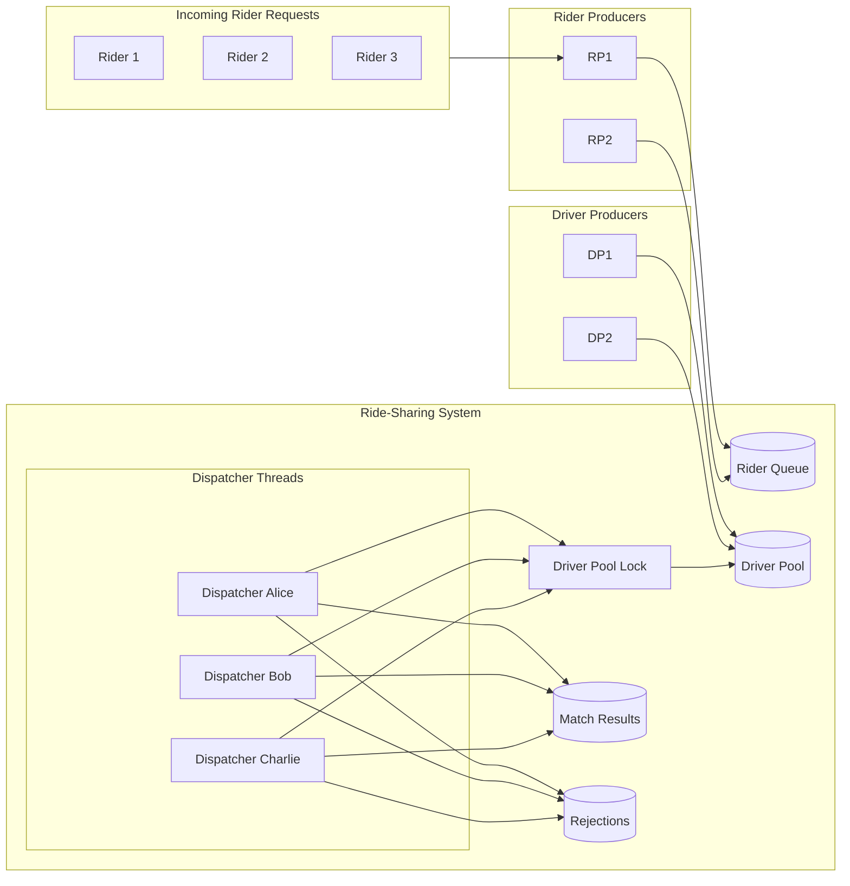
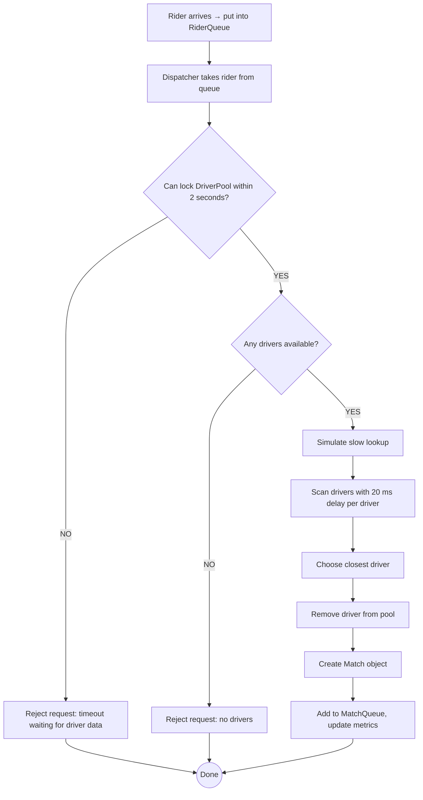

# Advanced Programming
## Auditory Exercise 8 (Concurrent Programming)

### 1. Parallel log processing

Your service write logs in separate files (a file can be related to a microservice and also one file per time interval).

Write a program that will give you the total number of ERROR logs in all files in a given directory.

Compare the time needed to process the files sequentially and concurrently.

```java
package class8.log_processor;

import java.io.IOException;
import java.nio.file.*;
import java.util.ArrayList;
import java.util.List;

public class LogErrorCounter {

    // ================================
    // Sequential approach
    // ================================
    public static long countErrorsSequential(List<Path> files) {
        long total = 0;
        for (Path file : files) {
            try {
                long count = Files.lines(file)
                        .filter(line -> line.contains("ERROR"))
                        .count();
                total += count;
            } catch (IOException e) {
                System.err.println("Failed to read file: " + file);
            }
        }
        return total;
    }

    // ================================
    // Concurrent approach
    // ================================
    private static class ErrorCounterTask extends Thread {
        private final Path file;
        private long errorCount = 0;

        public ErrorCounterTask(Path file) {
            this.file = file;
        }

        @Override
        public void run() {
            try {
                errorCount = Files.lines(file)
                        .filter(line -> line.contains("ERROR"))
                        .count();
            } catch (IOException e) {
                System.err.println("Failed to read file: " + file);
            }
        }

        public long getErrorCount() {
            return errorCount;
        }
    }

    public static long countErrorsConcurrent(List<Path> files) throws InterruptedException {
        List<ErrorCounterTask> tasks = new ArrayList<>();

        // Create and start threads
        for (Path file : files) {
            ErrorCounterTask task = new ErrorCounterTask(file);
            tasks.add(task);
            task.start();
        }

        // Wait for all threads
        long total = 0;
        for (ErrorCounterTask task : tasks) {
            task.join();
            total += task.getErrorCount();
        }
        return total;
    }

    // ================================
    // Runner with time measurement
    // ================================
    public static void main(String[] args) throws Exception {

        Path logsDir = Paths.get("src/class8/logs"); // <-- adjust if needed

        if (!Files.isDirectory(logsDir)) {
            System.err.println("Directory 'logs' not found!");
            return;
        }

        // Collect all .log files
        List<Path> files = new ArrayList<>();
        try (DirectoryStream<Path> ds = Files.newDirectoryStream(logsDir, "*.log")) {
            for (Path p : ds) files.add(p);
        }

        if (files.isEmpty()) {
            System.out.println("No log files found.");
            return;
        }

        System.out.println("Found " + files.size() + " log files.");
        System.out.println("-------------------------------------------");

        // Sequential measurement
        long startSeq = System.currentTimeMillis();
        long seqTotal = countErrorsSequential(files);
        long endSeq = System.currentTimeMillis();

        System.out.println("Sequential total errors: " + seqTotal);
        System.out.println("Sequential time: " + (endSeq - startSeq) + " ms");
        System.out.println();

        // Concurrent measurement
        long startConc = System.currentTimeMillis();
        long concTotal = countErrorsConcurrent(files);
        long endConc = System.currentTimeMillis();

        System.out.println("Concurrent total errors: " + concTotal);
        System.out.println("Concurrent time: " + (endConc - startConc) + " ms");
        System.out.println();

        // Cross-check correctness
        if (seqTotal == concTotal) {
            System.out.println("CORRECT: Both methods produced the same result.");
        } else {
            System.out.println("WARNING: Results differ! Sequential=" +
                    seqTotal + ", Concurrent=" + concTotal);
        }

        System.out.println("-------------------------------------------");
        System.out.println("Speedup: " + String.format("%.2f",
                (double) (endSeq - startSeq) / (endConc - startConc)) + "x faster");
    }
}

```


### 2. Single large file processing 

Count the frequency of each letter (a-z) in a large text file (e.g., a book).

Implement a concurrent approach where the file is divided into N parts, and each part is processed by a separate thread.

Compare the time taken for sequential and concurrent processing.

```java
package class8.parallel_letter_counter;

import java.io.IOException;
import java.nio.file.*;
import java.util.ArrayList;
import java.util.List;

public class LetterFrequencyCounter {

    // ============================================
    // Sequential letter counter
    // ============================================
    public static int[] countSequential(String text) {
        int[] counts = new int[26];

        for (char c : text.toCharArray()) {
            if (Character.isLetter(c)) {
                int index = Character.toLowerCase(c) - 'a';
                if (index >= 0 && index < 26) {
                    counts[index]++;
                }
            }
        }

        return counts;
    }

    // ============================================
    // Worker thread for parallel processing
    // ============================================
    private static class LetterCounterWorker extends Thread {
        private final String text; //shared memory
        private final int start;
        private final int end;
        private final int[] localCounts = new int[26]; //local memory

        public LetterCounterWorker(String text, int start, int end) {
            this.text = text;
            this.start = start;
            this.end = end;
        }

        @Override
        public void run() {
            for (int i = start; i < end; i++) {
                char c = text.charAt(i);
                if (Character.isLetter(c)) {
                    int index = Character.toLowerCase(c) - 'a';
                    if (index >= 0 && index < 26) {
                        localCounts[index]++;
                    }
                }
            }
        }

        public int[] getLocalCounts() {
            return localCounts;
        }
    }

    // ============================================
    // Parallel letter counter
    // ============================================
    public static int[] countParallel(String text, int numThreads) throws InterruptedException {
        int length = text.length();
        int chunk = length / numThreads;

        List<LetterCounterWorker> workers = new ArrayList<>();

        for (int i = 0; i < numThreads; i++) {
            int start = i * chunk;
            int end = (i == numThreads - 1) ? length : start + chunk;

            LetterCounterWorker worker = new LetterCounterWorker(text, start, end);
            workers.add(worker);
            worker.start();
        }

        // Combine results
        int[] globalCounts = new int[26];

        for (LetterCounterWorker w : workers) {
            w.join();
            int[] local = w.getLocalCounts();
            for (int i = 0; i < 26; i++) {
                globalCounts[i] += local[i];
            }
        }

        return globalCounts;
    }

    // ============================================
    // Helper → print histogram
    // ============================================
    public static void printCounts(int[] counts) {
        for (int i = 0; i < 26; i++) {
            char letter = (char) ('a' + i);
            System.out.printf("%c: %d%n", letter, counts[i]);
        }
    }

    // ============================================
    // MAIN — loads text, runs sequential & parallel
    // ============================================
    public static void main(String[] args) throws Exception {

        Path filePath = Paths.get("src/class8/large_text.txt");

        if (!Files.exists(filePath)) {
            System.err.println("File 'large_text.txt' not found!");
            return;
        }

        String text = Files.readString(filePath);

        System.out.println("Text length: " + text.length());
        System.out.println("---------------------------------------");

        // ====================================
        // Sequential timing
        // ====================================
        long startSeq = System.currentTimeMillis();
        int[] seqCounts = countSequential(text);
        long endSeq = System.currentTimeMillis();

        System.out.println("Sequential time: " + (endSeq - startSeq) + " ms");

        // ====================================
        // Parallel timing
        // ====================================
        int numThreads = 2;
//                Runtime.getRuntime().availableProcessors();

//        System.out.println(numThreads);

        long startPar = System.currentTimeMillis();
        int[] parCounts = countParallel(text, 4);
        long endPar = System.currentTimeMillis();

        System.out.println("Parallel time (" + numThreads + " threads): " + (endPar - startPar) + " ms");

        // ====================================
        // Compare results
        // ====================================
        boolean same = true;
        for (int i = 0; i < 26; i++) {
            if (seqCounts[i] != parCounts[i]) {
                same = false;
                break;
            }
        }

        if (same)
            System.out.println("CORRECT: Sequential and parallel results match.");
        else
            System.out.println("ERROR: Results do NOT match!");

        System.out.println("---------------------------------------");
        System.out.println("Speedup: " + String.format("%.2f",
                (double) (endSeq - startSeq) / (endPar - startPar)) + "x");
    }
}
```

### 3. API calls

LLMs often take a while to generate a response – several seconds per request.
In the folder `questions/`, you have multiple text files with different prompts about multithreading in Java.
Implement a program that makes multiple API calls to OpenAI's GPT-4o-mini model (in order to generate a response to your prompts) in parallel using multithreading (Executor Service).

Compare the time taken for sequential vs concurrent API calls.

```java
package class8.parallel_api_calls;

import java.io.*;
import java.net.HttpURLConnection;
import java.net.URL;
import java.nio.charset.StandardCharsets;
import java.nio.file.*;
import java.util.*;
import java.util.concurrent.*;
import java.util.stream.Collectors;

public class Main {

    private static final String API_KEY = System.getenv("OPENAI_API_KEY");
    private static final String ENDPOINT = "https://api.openai.com/v1/chat/completions";

    public static String extractContent(String json) {

        // Find the `"content":` field AFTER `"message"`
        String messageMarker = "\"message\":";
        int messageIndex = json.indexOf(messageMarker);
        if (messageIndex == -1) return null;

        String contentMarker = "\"content\":";
        int contentIndex = json.indexOf(contentMarker, messageIndex);
        if (contentIndex == -1) return null;

        // Find first quote AFTER "content":
        int startQuote = json.indexOf("\"", contentIndex + contentMarker.length());
        if (startQuote == -1) return null;

        // Find the closing quote
        int endQuote = json.indexOf("\"", startQuote + 1);
        if (endQuote == -1) return null;

        // Extract content
        String result = json.substring(startQuote + 1, endQuote);

        // Handle escaped newlines or quotes if needed
        return result.replace("\\n", "\n").replace("\\\"", "\"");
    }


    // ================================================================
    // MAKE A SINGLE OPENAI REQUEST
    // ================================================================
    public static String callOpenAI(String prompt) throws IOException {
        URL url = new URL(ENDPOINT);
        HttpURLConnection conn = (HttpURLConnection) url.openConnection();

        conn.setRequestMethod("POST");
        conn.setRequestProperty("Authorization", "Bearer " + API_KEY);
        conn.setRequestProperty("Content-Type", "application/json");
        conn.setDoOutput(true);

        String body = """
        {
          "model": "gpt-4o-mini",
          "messages": [
            { "role": "system", "content": "You are a helpful assistant that answers questions about multithreading concepts in Java." },
            { "role": "user", "content": "%s" }
          ]
        }
        """.formatted(prompt.replace("\"", "'"));

        try (OutputStream os = conn.getOutputStream()) {
            os.write(body.getBytes(StandardCharsets.UTF_8));
        }

        if (conn.getResponseCode()==200){
            return extractContent(new String(conn.getInputStream().readAllBytes(), StandardCharsets.UTF_8));
        } else {
            return new String(conn.getErrorStream().readAllBytes(), StandardCharsets.UTF_8);
        }
    }

    // ================================================================
    // SEQUENTIAL EXECUTION
    // ================================================================
    public static List<String> runSequential(List<String> prompts) throws IOException {
        List<String> outputs = new ArrayList<>();

        long start = System.currentTimeMillis();
        for (String p : prompts) {
            outputs.add(callOpenAI(p));
        }
        long end = System.currentTimeMillis();

        System.out.println("Sequential time: " + (end - start) + " ms");
        return outputs;
    }

    // ================================================================
    // CONCURRENT EXECUTION
    // ================================================================
    public static List<String> runConcurrent(List<String> prompts, int threadCount) throws Exception {
        ExecutorService executor = Executors.newFixedThreadPool(threadCount);
        List<Future<String>> futures = new ArrayList<>();

        long start = System.currentTimeMillis();

        for (String p : prompts) {
            Callable<String> task = () -> callOpenAI(p);
            futures.add(executor.submit(task));
        }

        List<String> outputs = new ArrayList<>();
        for (Future<String> f : futures) {
            outputs.add(f.get());
        }

        executor.shutdown();
        executor.awaitTermination(1, TimeUnit.MINUTES);

        long end = System.currentTimeMillis();
        System.out.println("Concurrent time (" + threadCount + " threads): " + (end - start) + " ms");

        return outputs;
    }

    // ================================================================
    // MAIN
    // ================================================================
    public static void main(String[] args) throws Exception {

        // Load all text files from /questions directory
        Path promptDir = Paths.get("src/class8/questions");
        if (!Files.exists(promptDir)) {
            System.err.println("Directory 'questions/' not found!");
            return;
        }

        List<String> prompts = new ArrayList<>();
        try (DirectoryStream<Path> stream = Files.newDirectoryStream(promptDir, "*.txt")) {
            for (Path p : stream) {
                prompts.add(Files.readString(p));
            }
        }

        System.out.println("Loaded " + prompts.size() + " prompts.");
        System.out.println("======================================");

        // Sequential
        List<String> sequentialResults = runSequential(prompts);

        System.out.println("Sequential results: " + sequentialResults.stream().collect(Collectors.joining("\n")));

        // Concurrent (using CPU cores)
        int threads = Math.min(prompts.size(), Runtime.getRuntime().availableProcessors());
        List<String> concurrentResults = runConcurrent(prompts, threads);

        System.out.println("Concurrent results: " + concurrentResults.stream().collect(Collectors.joining("\n")));

        System.out.println("======================================");
        System.out.println("Speedup: compare times above manually.");
    }
}

```


## 4. Search Cache



Create a thread-safe search cache that stores results with a Time-to-Live (TTL) and removes expired entries automatically.

Requirements:

- When a search query is requested:

  - Check the cache first. 
  
  - If the entry exists and is not expired → return it. 
  
  - Otherwise → call the provided SearchEngine to fetch results and store them in the cache with a new TTL.
  
- Cache entries must store:

  - the result list 
  
  - an expiration timestamp (TTL)
  
- A scheduled task must periodically scan the cache and delete expired entries.

- The system must support multiple threads performing searches at the same time without data races.

- Provide a demo program that:

  - runs several search requests concurrently, 
  
  - shows cache hits, misses, and cleanup in action.

```java
package class8.cache;

import java.time.Instant;
import java.util.*;
import java.util.concurrent.*;
import java.util.concurrent.locks.ReadWriteLock;
import java.util.concurrent.locks.ReentrantLock;
import java.util.concurrent.locks.ReentrantReadWriteLock;
import java.util.stream.Collectors;

// ============================================================================
// SearchResult: stores results + TTL + locking
// ============================================================================
class SearchResult {
    private List<String> results;
    private Instant expiresAt;
    private final ReadWriteLock lock = new ReentrantReadWriteLock();

    public SearchResult(List<String> results, long ttlSeconds) {
        this.results = results;
        this.expiresAt = Instant.now().plusSeconds(ttlSeconds);
    }

    public boolean isExpired() {
        return Instant.now().isAfter(expiresAt);
    }

    public void update(List<String> newResults, long ttlSeconds) {
        lock.writeLock().lock();
        try {
            this.results = newResults;
            this.expiresAt = Instant.now().plusSeconds(ttlSeconds);
            System.out.println(String.format("Updated results: %s with expiry at %d", this.results, this.expiresAt.toEpochMilli()));
        } finally {
            lock.writeLock().unlock();
        }
    }

    public List<String> getResults() {
        lock.readLock().lock();
        try {
            return List.copyOf(results);
        } finally {
            lock.readLock().unlock();
        }
    }

    public ReadWriteLock getLock() {
        return lock;
    }
}

// ============================================================================
// SearchEngine: simulates slow search API
// ============================================================================
class SearchEngine {

    public List<String> search(String query) {
        try { Thread.sleep(400); } catch (InterruptedException ignored) {}

        return List.of(
                query + " - result A",
                query + " - result B",
                query + " - result C " + new Random().nextInt(100)
        );
    }
}

// ============================================================================
// SearchCache: handles cache lookup, TTL, fallback search, concurrency
// ============================================================================
class SearchCache {

    private final ConcurrentHashMap<String, SearchResult> cache = new ConcurrentHashMap<>();
    private final SearchEngine searchEngine;
    private final long ttlSeconds;

    public SearchCache(SearchEngine searchEngine, long ttlSeconds) {
        this.searchEngine = searchEngine;
        this.ttlSeconds = ttlSeconds;
    }

    public List<String> search(String query) {
        SearchResult entry = cache.get(query);

        // Fast path: cached & not expired
        if (entry != null && !entry.isExpired()) {
            return entry.getResults();
        }

        // compute() prevents race conditions and ensures only one fetch
        return cache.compute(query, (q, existing) -> {

            if (existing != null && !existing.isExpired()) {
                return existing;
            }

            List<String> fresh = searchEngine.search(query);

            if (existing == null) {
                return new SearchResult(fresh, ttlSeconds);
            } else {
                System.out.println(String.format("Starting to update results for search term %s with %s", q, fresh));
                existing.update(fresh, ttlSeconds);
                return existing;
            }

        }).getResults();
    }

    public ConcurrentHashMap<String, SearchResult> getCacheMap() {
        return cache;
    }
}

// ============================================================================
// SearchCacheCleaner: scheduled cleanup of expired entries
// ============================================================================
class SearchCacheCleaner {

    private final SearchCache cache;
    private final ScheduledExecutorService scheduler =
            Executors.newScheduledThreadPool(1);

    public SearchCacheCleaner(SearchCache cache) {
        this.cache = cache;
    }

    public void startCleanupTask() {
        scheduler.scheduleAtFixedRate(() -> {
            System.out.println("[Cleanup] Checking expired entries...");

            for (Map.Entry<String, SearchResult> entry : cache.getCacheMap().entrySet()) {
                SearchResult sr = entry.getValue();

                sr.getLock().readLock().lock();
                try {
                    if (sr.isExpired()) {
                        System.out.println(" -> Removing: " + entry.getKey());
                        cache.getCacheMap().remove(entry.getKey());
                    }
                } finally {
                    sr.getLock().readLock().unlock();
                }
            }

        }, 3, 3, TimeUnit.SECONDS);
    }

    public void stop() {
        scheduler.shutdown();
    }
}

// ============================================================================
// Main: handles user input & demonstrates caching behavior
// ============================================================================
public class SearchCacheDemo {

    public static void main(String[] args) throws InterruptedException {
        SearchEngine engine = new SearchEngine();
        SearchCache cache = new SearchCache(engine, 5); // TTL = 10 seconds
        SearchCacheCleaner cleaner = new SearchCacheCleaner(cache);
        cleaner.startCleanupTask();

//        Scanner sc = new Scanner(System.in);
//        System.out.println("=== Search Cache Demo (TTL = 10s) ===");

        //sequential searches
//        while (true) {
//            System.out.print("\nSearch query (type 'exit' to quit): ");
//            String q = sc.nextLine().trim();
//
//            if (q.equalsIgnoreCase("exit")) break;
//
//            long start = System.currentTimeMillis();
//            List<String> results = cache.search(q);
//            long end = System.currentTimeMillis();
//
//            System.out.println("Results: " + results);
//            System.out.println("Time: " + (end - start) + " ms");
//            System.out.println("(Cache size: " + cache.getCacheMap().size() + ")");
//        }

        //concurrent searches

        System.out.println("=== Concurrent Search Cache Demo (TTL = 10s) ===");

        // Example queries different threads will use
        List<String> queries = List.of(
                "java", "concurrency", "executor", "cache", "ttl"
//                "java", "concurrency", "executor", "cache", "ttl"
        );

        ExecutorService executor = Executors.newFixedThreadPool(5);
        Random random = new Random();

        for (int i = 0; i < 1000; i++) {
            String query = queries.get(random.nextInt(queries.size()));
            if (i%10==0) {
                Thread.sleep(random.nextInt(500, 2000));
            }
            executor.submit(() -> {
                try {
                    long start = System.currentTimeMillis();
                    List<String> results = cache.search(query);
                    long end = System.currentTimeMillis();

                    System.out.println(Thread.currentThread().getName()
                            + " | Query: " + query
                            + " | Results: " + results
                            + " | Time: " + (end - start) + " ms");
                } catch (Exception e) {
                    System.out.println(e.getMessage());
                }
            });
        }

        executor.shutdown();
//        executor.awaitTermination(1, TimeUnit.MINUTES);

        System.out.println("\n=== All threads finished ===");
        System.out.println("Final cache size: " + cache.getCacheMap().size());

        cleaner.stop();
    }
}


```

## 4. Taxi company simulation







```java
package class8;

import java.time.Instant;
import java.util.*;
import java.util.concurrent.*;
import java.util.concurrent.atomic.AtomicInteger;
import java.util.concurrent.atomic.AtomicLong;
import java.util.concurrent.locks.ReentrantLock;

// ------------------------------------------------------
// Domain classes
// ------------------------------------------------------

class Rider {
    private final String id;
    private final double x;
    private final double y;

    public Rider(String id, double x, double y) {
        this.id = id;
        this.x = x;
        this.y = y;
    }

    public String getId() { return id; }
    public double getX() { return x; }
    public double getY() { return y; }

    @Override
    public String toString() {
        return "Rider{" + id + " @(" + x + "," + y + ")}";
    }
}

class Driver {
    private final String id;
    private final double x;
    private final double y;

    public Driver(String id, double x, double y) {
        this.id = id;
        this.x = x;
        this.y = y;
    }

    public String getId() { return id; }
    public double getX() { return x; }
    public double getY() { return y; }

    @Override
    public String toString() {
        return "Driver{" + id + " @(" + x + "," + y + ")}";
    }
}

class Match {
    private final Rider rider;
    private final Driver driver;
    private final double distance;
    private final Instant matchedAt = Instant.now();

    public Match(Rider r, Driver d, double distance) {
        this.rider = r;
        this.driver = d;
        this.distance = distance;
    }

    @Override
    public String toString() {
        return "Match: " + rider.getId() + " -> " + driver.getId() +
                " (dist=" + String.format("%.2f", distance) + ") at " + matchedAt;
    }
}

// ------------------------------------------------------
// Advanced ride-sharing service
// ------------------------------------------------------

class RideSharingRealisticService {

    private final BlockingQueue<Rider> riderQueue = new LinkedBlockingQueue<>();

    private final List<Driver> driverPool = new ArrayList<>();
    private final ReentrantLock driverLock = new ReentrantLock(); // must lock for accessing pool

    private final BlockingQueue<Match> matches = new LinkedBlockingQueue<>();
    private final BlockingQueue<String> rejections = new LinkedBlockingQueue<>();

    private final AtomicInteger matchCount = new AtomicInteger();
    private final AtomicInteger rejectionCount = new AtomicInteger();
    private final AtomicLong totalDistance = new AtomicLong();

    private final Random random = new Random();

    public void addRider(Rider r) {
        riderQueue.offer(r);
        System.out.println("[RIDER] " + r);
    }

    public void addDriver(Driver d) {
        driverLock.lock();
        try {
            driverPool.add(d);
        } finally {
            driverLock.unlock();
        }
        System.out.println("[DRIVER] " + d);
    }

    // Dispatcher logic
    public void startDispatcher(String dispatcherName) {
        Thread dispatcher = new Thread(() -> {

            System.out.println("[DISPATCHER " + dispatcherName + "] Started");

            try {
                while (true) {

                    Rider r = riderQueue.take();

                    // Try to access drivers within 2 seconds
                    boolean gotLock = driverLock.tryLock(2, TimeUnit.SECONDS);

                    if (!gotLock) {
                        rejectionCount.incrementAndGet();
                        String reason = "[REJECT] " + dispatcherName +
                                " => Could not access drivers in time for " + r.getId();
                        rejections.offer(reason);
                        System.out.println(reason);

                        continue;
                    }

                    Driver closest = null;
                    double bestDist = Double.MAX_VALUE;

                    try {
                        if (driverPool.isEmpty()) {
                            rejectionCount.incrementAndGet();
                            String reason = "[REJECT] " + dispatcherName +
                                    " => No drivers available for " + r.getId();
                            rejections.offer(reason);
                            System.out.println(reason);

                            continue;
                        }

                        // artificial delay for searching (simulate database or GPS lookup)
                        Thread.sleep(200 + random.nextInt(300));

                        for (Driver d : driverPool) {
                            double dist = distance(r, d);
                            try { Thread.sleep(20); } catch (InterruptedException ignored) {} // simulate slow search
                            if (dist < bestDist) {
                                bestDist = dist;
                                closest = d;
                            }
                        }

                        driverPool.remove(closest);

                    } finally {
                        driverLock.unlock();
                    }

                    Match m = new Match(r, closest, bestDist);
                    matches.offer(m);

                    totalDistance.addAndGet((long) bestDist);
                    matchCount.incrementAndGet();

                    System.out.println("[MATCH by " + dispatcherName + "] " + m);
                }

            } catch (InterruptedException e) {
                System.out.println("[DISPATCHER " + dispatcherName + "] Stopped");
            }

        }, "Dispatcher-" + dispatcherName);

        dispatcher.start();
    }

    private double distance(Rider r, Driver d) {
        double dx = r.getX() - d.getX();
        double dy = r.getY() - d.getY();
        return Math.sqrt(dx * dx + dy * dy);
    }

    // Metrics
    public int getMatchCount() { return matchCount.get(); }
    public int getRejectionCount() { return rejectionCount.get(); }

    public int getDriverCount() {
        driverLock.lock();
        try {
            return driverPool.size();
        } finally {
            driverLock.unlock();
        }
    }

    public int getRiderQueueSize() {
        return riderQueue.size();
    }

    public double getAvgDistance() {
        int count = matchCount.get();
        if (count == 0) return 0;
        return totalDistance.get() * 1.0 / count;
    }
}

// ------------------------------------------------------
// Demo
// ------------------------------------------------------

public class RideSharingRealisticDemo {

    public static void main(String[] args) throws InterruptedException {
        RideSharingRealisticService service = new RideSharingRealisticService();
        Random random = new Random();

        // Start multiple dispatchers
        service.startDispatcher("Alice");
        service.startDispatcher("Bob");
        service.startDispatcher("Charlie");

        ExecutorService producers = Executors.newFixedThreadPool(4);

        Runnable riderProducer = () -> {
            int c = 0;
            try {
                while (true) {
                    String id = "R" + Thread.currentThread().getId() + "-" + (c++);
                    service.addRider(new Rider(id, random.nextDouble() * 10, random.nextDouble() * 10));
                    Thread.sleep(random.nextInt(300));
                }
            } catch (InterruptedException ignored) {}
        };

        Runnable driverProducer = () -> {
            int c = 0;
            try {
                while (true) {
                    String id = "D" + Thread.currentThread().getId() + "-" + (c++);
                    service.addDriver(new Driver(id, random.nextDouble() * 10, random.nextDouble() * 10));
                    Thread.sleep(250 + random.nextInt(350));
                }
            } catch (InterruptedException ignored) {}
        };

        producers.submit(riderProducer);
        producers.submit(riderProducer);
        producers.submit(driverProducer);
        producers.submit(driverProducer);

        // Metrics monitor
        ScheduledExecutorService monitor = Executors.newScheduledThreadPool(1);
        monitor.scheduleAtFixedRate(() -> {
            System.out.println("\n===== METRICS =====");
            System.out.println("Waiting riders: " + service.getRiderQueueSize());
            System.out.println("Available drivers: " + service.getDriverCount());
            System.out.println("Total matches: " + service.getMatchCount());
            System.out.println("Rejections: " + service.getRejectionCount());
            System.out.println("Average distance: " + String.format("%.2f", service.getAvgDistance()));
        }, 2, 3, TimeUnit.SECONDS);

        Thread.sleep(60000);

        System.out.println("\n[MAIN] Stopping simulation...");
        producers.shutdownNow();
        monitor.shutdownNow();
        System.out.println("[MAIN] Done.");
    }
}
```