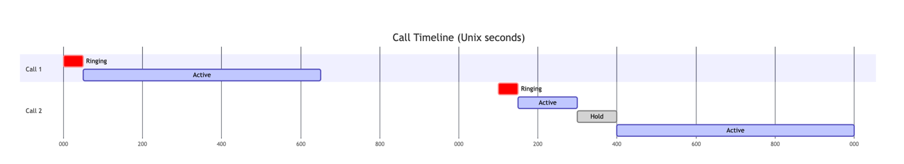
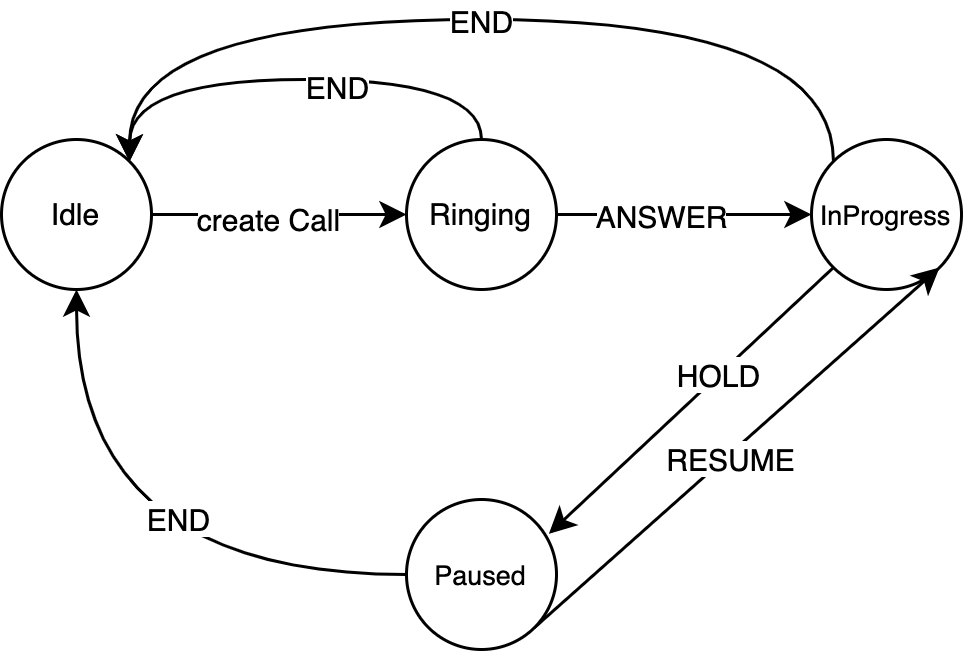

# Напредно програмирање
## Аудиториска вежба 9 (Рефакторирање и дизајн шаблони)

### TelCo

#### Барања
Имплементирајте апликација за евиденција на телефонски повици помеѓу телефонски броеви на ниво на еден телекомуникациски оператор.

Имплементирајте ја класата **TelcoApp** со следните методи:
- `void addCall(String uuid, String dialer, String receiver, long timestamp)`  
  Телефонскиот број `dialer` го повикува телефонскиот број `receiver` во време `timestamp`.

- `void updateCall(String uuid, long timestamp, String action)`  
  Метод за ажурирање на веќе иницијализиран телефонски повик од `dialer` до `receiver` во време `timestamp` со една од следните акции:
  - **ANSWER** (примачот го одговорил повикот)
  - **END** (еден од учесниците го завршил повикот)
  - **HOLD** (еден од учесниците го ставил повикот на чекање)
  - **RESUME** (повикот продолжил по тоа што бил ставен на чекање)

- `void printChronologicalReport(String phoneNumber)`  
  Испечати извештај за сите повици во кои учествува телефонскиот број `phoneNumber`, сортирани според времето на започнување на повикот.  
  Форматот на излезот е `R/D other_number start end MM:SS`, каде што:
  - **R** се печати ако телефонскиот број бил примач, а **D** ако бил повикувач
  - **other_number** е телефонскиот број на другата страна од повикот
  - **start** е времето на започнување на повикот (кога повикот бил одговорен)
  - **end** е времето на завршување на повикот
  - **MM:SS** е времетраењето на повикот во минути и секунди  
  Времетраењето на повикот не смее да ги вклучува интервалите поминати на чекање (помеѓу **HOLD** и **RESUME**).  
  Доколку повикот е пропуштен (примачот не одговорил), наместо `end` се печати **MISSED CALL**.  
  Времетраењето на пропуштен повик секогаш е `00:00`.

- `void printReportByDuration(String phoneNumber)`  
  Испечати извештај за сите повици во кои учествува телефонскиот број `phoneNumber`, сортирани според времетраењето на повикот во опаѓачки редослед.  
  Форматот на излезот е ист како во претходниот метод.

- `void printCallsDuration()`  
  Испечати извештај за вкупното времетраење на сите разговори помеѓу сите парови телефонски броеви.  
  **Забелешка:** Кога A го повикува B, тоа се смета за различен пар од кога B го повикува A.

- Дијаграмот на состојби подолу ги прикажува сите можни состојби на еден повик, како и акциите што го префрлаат повикот од една состојба во друга.

Визуелизација на влезот:

```markdown
addCall 1 076111111 076111112 1000
addCall 2 076111111 076111113 2100
updateCall 1 1050 ANSWER
updateCall 1 1700 END
updateCall 2 2150 ANSWER
updateCall 2 2300 HOLD
updateCall 2 2400 RESUME
updateCall 2 3000 END
```



#### Решение (без дизајн шаблони)
```java

```java
import java.util.*;
import java.util.stream.Collectors;

class DurationConverter {
    public static String convert(long duration) {
        long minutes = duration / 60;
        duration %= 60;
        return String.format("%02d:%02d", minutes, duration);
    }
}

enum CallStatus {
    INITIALIZED,
    IN_PROGRESS,
    PAUSED,
    ENDED
}

class InvalidOperation extends Exception {
}


class Call {
    String uuid;
    String dialer;
    String receiver;

    long initialized;
    long start = 0;
    long end = 0;

    long holdStarted = 0;
    long totalHoldDuration = 0;

    CallStatus status = CallStatus.INITIALIZED;

    public Call(String uuid, String dialer, String receiver, long initialized) {
        this.uuid = uuid;
        this.dialer = dialer;
        this.receiver = receiver;
        this.initialized = initialized;
    }

    public void updateCall(long timestamp, String action) throws InvalidOperation {

        if (action.equals("ANSWER")) {
            if (status != CallStatus.INITIALIZED)
                throw new InvalidOperation();

            start = timestamp;
            status = CallStatus.IN_PROGRESS;
        }

        else if (action.equals("HOLD")) {
            if (status != CallStatus.IN_PROGRESS)
                throw new InvalidOperation();

            holdStarted = timestamp;
            status = CallStatus.PAUSED;
        }

        else if (action.equals("RESUME")) {
            if (status != CallStatus.PAUSED)
                throw new InvalidOperation();

            totalHoldDuration += (timestamp - holdStarted);
            holdStarted = 0;
            status = CallStatus.IN_PROGRESS;
        }

        else if (action.equals("END")) {
            if (status == CallStatus.ENDED)
                throw new InvalidOperation();

            if (start == 0) {
                // missed call
                start = timestamp;
            }

            if (status == CallStatus.PAUSED) {
                totalHoldDuration += (timestamp - holdStarted);
                holdStarted = 0;
            }

            end = timestamp;
            status = CallStatus.ENDED;
        }
    }

    public long getStart() {
        return start == 0 ? initialized : start;
    }

    public long getTotalDuration() {
        if (end == 0) return 0;
        return end - start - totalHoldDuration;
    }

    public String getUuid() {
        return uuid;
    }
}

class TelcoApp {
    Map<String, Call> callsByUuid = new HashMap<>();
    Map<String, List<Call>> callsByPhoneNumber = new HashMap<>();
    Comparator<Call> byStart = Comparator.comparing(Call::getStart).thenComparing(Call::getUuid);
    Comparator<Call> byDuration = Comparator.comparing(Call::getTotalDuration).thenComparing(Call::getStart).reversed();

    void addCall(String uuid, String dialer, String receiver, long timestamp) {
        Call c = new Call(uuid, dialer, receiver, timestamp);
        callsByUuid.put(uuid, c);
        callsByPhoneNumber.putIfAbsent(dialer, new ArrayList<>());
        callsByPhoneNumber.get(dialer).add(c);
        callsByPhoneNumber.putIfAbsent(receiver, new ArrayList<>());
        callsByPhoneNumber.get(receiver).add(c);
    }

    void updateCall(String uuid, long timestamp, String action) {
        try {
            callsByUuid.get(uuid).updateCall(timestamp, action);
        } catch (InvalidOperation e) {
            System.out.println("Invalid operation " + action + " for call " + uuid);
        }
    }

    void printCall(Call c, String phoneNumber) {
        String type = c.dialer.equals(phoneNumber) ? "D" : "R";
        String otherPhoneNumber = c.dialer.equals(phoneNumber) ? c.receiver : c.dialer;
        String end = c.start==c.end ? "MISSED CALL" : String.valueOf(c.end);
        System.out.println(String.format("%s %s %d %s %s", type, otherPhoneNumber, c.getStart(), end, DurationConverter.convert(c.getTotalDuration())));

    }

    void printChronologicalReport(String phoneNumber) {
        callsByPhoneNumber.get(phoneNumber).stream().sorted(byStart).forEach(c -> {
            printCall(c, phoneNumber);
        });
    }

    void printReportByDuration(String phoneNumber) {
        callsByPhoneNumber.get(phoneNumber).stream().sorted(byDuration).forEach(c -> {
            printCall(c, phoneNumber);
        });
    }

    public void printCallsDuration() {
        TreeMap<String, Long> result = callsByUuid.values().stream().collect(Collectors.groupingBy(
                c -> String.format("%s <-> %s", c.dialer, c.receiver),
                TreeMap::new,
                Collectors.summingLong(Call::getTotalDuration)
        ));

        result.entrySet().stream()
                .sorted(Map.Entry.comparingByValue(Comparator.reverseOrder()))
                .forEach(entry -> System.out.printf("%s : %s%n", entry.getKey(), DurationConverter.convert(entry.getValue())));
    }
}


public class TelcoTest2 {
    public static void main(String[] args) {
        TelcoApp app = new TelcoApp();

        Scanner sc = new Scanner(System.in);

        while (sc.hasNextLine()) {
            String line = sc.nextLine();
            String[] parts = line.split("\\s+");
            String command = parts[0];

            if (command.equals("addCall")) {
                String uuid = parts[1];
                String dialer = parts[2];
                String receiver = parts[3];
                long timestamp = Long.parseLong(parts[4]);
                app.addCall(uuid, dialer, receiver, timestamp);
            } else if (command.equals("updateCall")) {
                String uuid = parts[1];
                long timestamp = Long.parseLong(parts[2]);
                String action = parts[3];
                app.updateCall(uuid, timestamp, action);
            } else if (command.equals("printChronologicalReport")) {
                String phoneNumber = parts[1];
                app.printChronologicalReport(phoneNumber);
            } else if (command.equals("printReportByDuration")) {
                String phoneNumber = parts[1];
                app.printReportByDuration(phoneNumber);
            } else {
                app.printCallsDuration();
            }
        }

    }
}

```


#### Решение (со дизајн шаблони)

**Насока за рефакторирање:**
Користењето на повеќе `if-else` наредби за проверка на тековната состојба на еден објект претставува code smell.
Методот `updateCall` во класата `Call` може да се рефакторира со користење на State дизајн шаблонот.

##### Дијаграм на конечна машина на состојби за еден повик




```java
import java.time.Duration;
import java.time.LocalDateTime;
import java.util.*;
import java.util.stream.Collectors;

class DurationConverter {
    public static String convert(long duration) {
        long minutes = duration / 60;
        duration %= 60;
        return String.format("%02d:%02d", minutes, duration);
    }
}

class Call {
    String uuid;
    String dialer;
    String receiver;
    public CallState state;

    public Call(String uuid, String dialer, String receiver, long initialized) {
        this.uuid = uuid;
        this.dialer = dialer;
        this.receiver = receiver;
        state = new InitializedState(this);
        state.initialized = initialized;
    }

    public void updateCall(long timestamp, String state) throws InvalidOperation {
        if (state.equals("ANSWER")) {
            this.state.answer(timestamp);
        } else if (state.equals("END")) {
            this.state.end(timestamp);
        } else if (state.equals("HOLD")) {
            this.state.hold(timestamp);
        } else if (state.equals("RESUME")) {
            this.state.resume(timestamp);
        }
    }

    public long getStart() {
        return state.start == 0 ? state.initialized : state.start;
    }

    public String getUuid() {
        return uuid;
    }

    long getTotalDuration() {
        return state.getTotalDuration();
    }
}

interface ICallState {
    void answer(long timestamp) throws InvalidOperation;

    void end(long timestamp) throws InvalidOperation;

    void hold(long timestamp) throws InvalidOperation;

    void resume(long timestamp) throws InvalidOperation;
}

abstract class CallState implements ICallState {
    Call call;
    public long initialized;
    public long start;
    public long end;
    public long holdStarted;
    public long holdEnded;
    public int durationHold;

    public CallState(Call call) {
        this.call = call;
    }

    public CallState(CallState oldState) {
        this.initialized = oldState.initialized;
        this.start = oldState.start;
        this.end = oldState.end;
        this.holdStarted = oldState.holdStarted;
        this.holdEnded = oldState.holdEnded;
        this.durationHold = oldState.durationHold;
        this.call = oldState.call;
    }

    public long getTotalDuration() {
        return end == 0 ? 0 : (end - start - durationHold);
    }

    void endHold(long timestamp) {
        this.holdEnded = timestamp;
        this.durationHold += (holdEnded - holdStarted);
        this.holdStarted = 0;
        this.holdEnded = 0;
    }
}

class InvalidOperation extends Exception {

}

class InitializedState extends CallState {

    public InitializedState(Call call) {
        super(call);
    }

    public InitializedState(CallState callState) {
        super(callState);
    }

    @Override
    public void answer(long timestamp) {
        this.start = timestamp;
        call.state = new InProgressState(this);

    }

    @Override
    public void end(long timestamp) {
        this.start = timestamp;
        call.state = new IdleState(this);

    }

    @Override
    public void hold(long timestamp) throws InvalidOperation {
        throw new InvalidOperation();
    }

    @Override
    public void resume(long timestamp) throws InvalidOperation {
        throw new InvalidOperation();
    }
}

class InProgressState extends CallState {

    public InProgressState(Call call) {
        super(call);
    }

    public InProgressState(CallState callState) {
        super(callState);
    }

    @Override
    public void answer(long timestamp) throws InvalidOperation {
        throw new InvalidOperation();
    }

    @Override
    public void end(long timestamp) {
        this.end = timestamp;
        call.state = new IdleState(this);
    }

    @Override
    public void hold(long timestamp) {
        this.holdStarted = timestamp;
        call.state = new PausedState(this);
    }

    @Override
    public void resume(long timestamp) throws InvalidOperation {
        throw new InvalidOperation();
    }
}

class PausedState extends CallState {

    public PausedState(Call call) {
        super(call);
    }

    public PausedState(CallState callState) {
        super(callState);
    }

    @Override
    public void answer(long timestamp) throws InvalidOperation {
        throw new InvalidOperation();
    }

    @Override
    public void end(long timestamp) {
        this.endHold(timestamp);
        this.end = timestamp;
        call.state = new IdleState(this);
    }

    @Override
    public void hold(long timestamp) throws InvalidOperation {
        throw new InvalidOperation();
    }

    @Override
    public void resume(long timestamp) {
        this.endHold(timestamp);
        call.state = new InProgressState(this);
    }
}

class IdleState extends CallState {

    public IdleState(Call call) {
        super(call);
    }

    public IdleState(CallState callState) {
        super(callState);
    }

    @Override
    public void answer(long timestamp) throws InvalidOperation {
        throw new InvalidOperation();
    }

    @Override
    public void end(long timestamp) throws InvalidOperation {
        throw new InvalidOperation();
    }

    @Override
    public void hold(long timestamp) throws InvalidOperation {
        throw new InvalidOperation();
    }

    @Override
    public void resume(long timestamp) throws InvalidOperation {
        throw new InvalidOperation();
    }
}

class TelcoApp {
    Map<String, Call> callsByUuid = new HashMap<>();
    Map<String, List<Call>> callsByPhoneNumber = new HashMap<>();
    Comparator<Call> byStart = Comparator.comparing(Call::getStart).thenComparing(Call::getUuid);
    Comparator<Call> byDuration = Comparator.comparing(Call::getTotalDuration).thenComparing(Call::getStart).reversed();

    void addCall(String uuid, String dialer, String receiver, long timestamp) {
        Call c = new Call(uuid, dialer, receiver, timestamp);
        callsByUuid.put(uuid, c);
        callsByPhoneNumber.putIfAbsent(dialer, new ArrayList<>());
        callsByPhoneNumber.get(dialer).add(c);
        callsByPhoneNumber.putIfAbsent(receiver, new ArrayList<>());
        callsByPhoneNumber.get(receiver).add(c);
    }

    void updateCall(String uuid, long timestamp, String action) {
        try {
            callsByUuid.get(uuid).updateCall(timestamp, action);
        } catch (InvalidOperation e) {
            System.out.println("Invalid operation " + action + " for call " + uuid);
        }
    }

    void printCall(Call c, String phoneNumber) {
        String type = c.dialer.equals(phoneNumber) ? "D" : "R";
        String otherPhoneNumber = c.dialer.equals(phoneNumber) ? c.receiver : c.dialer;
        String end = c.state.end == 0 ? "MISSED CALL" : String.valueOf(c.state.end);
        System.out.println(String.format("%s %s %d %s %s", type, otherPhoneNumber, c.getStart(), end, DurationConverter.convert(c.getTotalDuration())));

    }

    void printChronologicalReport(String phoneNumber) {
        callsByPhoneNumber.get(phoneNumber).stream().sorted(byStart).forEach(c -> {
            printCall(c, phoneNumber);
        });
    }

    void printReportByDuration(String phoneNumber) {
        callsByPhoneNumber.get(phoneNumber).stream().sorted(byDuration).forEach(c -> {
            printCall(c, phoneNumber);
        });
    }

    public void printCallsDuration() {
        TreeMap<String, Long> result = callsByUuid.values().stream().collect(Collectors.groupingBy(
                c -> String.format("%s <-> %s", c.dialer, c.receiver),
                TreeMap::new,
                Collectors.summingLong(Call::getTotalDuration)
        ));

        result.entrySet().stream()
                .sorted(Map.Entry.comparingByValue(Comparator.reverseOrder()))
                .forEach(entry -> System.out.printf("%s : %s%n", entry.getKey(), DurationConverter.convert(entry.getValue())));
    }
}


public class TelcoTest2 {
    public static void main(String[] args) {
        TelcoApp app = new TelcoApp();

        Scanner sc = new Scanner(System.in);

        while (sc.hasNextLine()) {
            String line = sc.nextLine();
            String[] parts = line.split("\\s+");
            String command = parts[0];

            if (command.equals("addCall")) {
                String uuid = parts[1];
                String dialer = parts[2];
                String receiver = parts[3];
                long timestamp = Long.parseLong(parts[4]);
                app.addCall(uuid, dialer, receiver, timestamp);
            } else if (command.equals("updateCall")) {
                String uuid = parts[1];
                long timestamp = Long.parseLong(parts[2]);
                String action = parts[3];
                app.updateCall(uuid, timestamp, action);
            } else if (command.equals("printChronologicalReport")) {
                String phoneNumber = parts[1];
                app.printChronologicalReport(phoneNumber);
            } else if (command.equals("printReportByDuration")) {
                String phoneNumber = parts[1];
                app.printReportByDuration(phoneNumber);
            } else {
                app.printCallsDuration();
            }
        }
    }
}

```